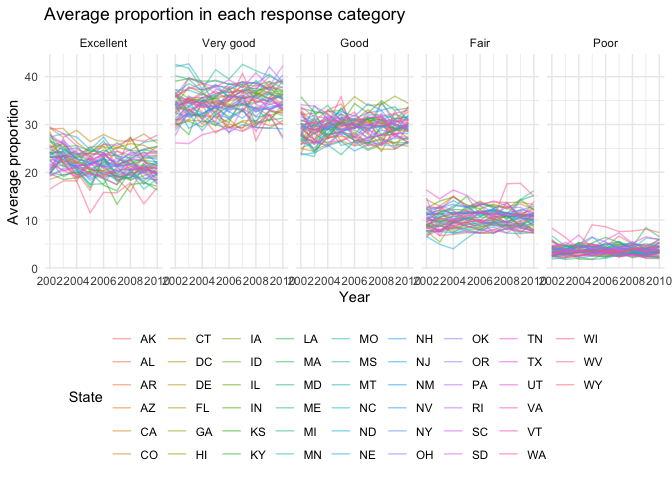

Visualization and EDA
================
Grace Liu
10/11/2018

Problem 1
---------

``` r
brfss_data = brfss_smart2010 %>% 
  janitor::clean_names() %>% 
  filter(topic == "Overall Health") %>% 
  mutate(response = factor(response, levels = c("Excellent", "Very good", "Good", "Fair", "Poor")))
```

**In 2002, which states were observed at 7 locations? **

``` r
brfss_data %>% 
  group_by(year, locationabbr) %>% 
  filter(year == 2002) %>% 
  summarize(n_locations = n_distinct(locationdesc)) %>% 
  filter(n_locations == 7) %>% 
  knitr::kable()
```

|  year| locationabbr |  n\_locations|
|-----:|:-------------|-------------:|
|  2002| CT           |             7|
|  2002| FL           |             7|
|  2002| NC           |             7|

In 2002, there were 3 states where 7 locations were observed.

**“Spaghetti plot” showing the number of locations in each state from 2002 to 2010**

``` r
brfss_data %>%
  group_by(year, locationabbr) %>%
  count(n_locations = n_distinct(locationdesc)) %>% 
  ggplot(aes(x = year, y = n_locations)) + 
    geom_line(aes(color = locationabbr), alpha = .5) +
    labs(
      title = "Number of locations in each state, 2002-2010",
      x = "Year",
      y = "Number of locations") + 
    theme_minimal() +
    theme(legend.position = "bottom") +
    guides(col = guide_legend(ncol = 10, title = "State"))
```


The graph above shows the count of locations observed in each (plus DC) for each year between 2002 to 2010.

**Proportion of “Excellent” responses across locations in NY State**

``` r
brfss_data %>%
  group_by(year) %>%
  filter(locationabbr == "NY" & year %in% c(2002, 2006, 2010) & response == "Excellent") %>%
  summarize(mean_excellent = mean(data_value, na.rm = TRUE), 
            sd_excellent = sd(data_value, na.rm = TRUE)) %>% 
  knitr::kable(digits = 2)
```

|  year|  mean\_excellent|  sd\_excellent|
|-----:|----------------:|--------------:|
|  2002|            24.04|           4.49|
|  2006|            22.53|           4.00|
|  2010|            22.70|           3.57|

The mean (standard deviation) of the proportion of “Excellent” responses across locations in NY State was 24.04 (4.49) in 2002, 22.53 (4.00) in 2006, and 22.70 (3.57) in 2010.

**Average proportion in each response category, by response and state**

``` r
brfss_data %>%
  group_by(year, locationabbr, response) %>%
  summarize(mean_response = mean(data_value, na.rm = TRUE)) %>% 
  ggplot(aes(x = year, y = mean_response, color = locationabbr)) + 
    geom_line(alpha = .5) +
    labs(title = "Average proportion in each response category",
      x = "Year",
      y = "Average proportion") + 
    theme_minimal() +
    theme(legend.position = "bottom") +
    guides(col = guide_legend(ncol = 10, title = "State")) +
    facet_grid(~response)
```



The above graph shows, for each response category, the distribution of state-level average proportions over time.

Problem 2
---------

**Short description of the dataset**
This dataset has 1,384,617 observations in 15 variables, with 1384617 rows and 15 columns. There are 21 departments with 134 distinct aisles containing 39123 products. This dataset summarizes the contents of 131209 distinct orders placed by 131209 users.

**How many aisles are there, and which aisles are the most items ordered from?**

``` r
instacart_data %>%
  summarize(n_distinct(aisle_id))
```

    ## # A tibble: 1 x 1
    ##   `n_distinct(aisle_id)`
    ##                    <int>
    ## 1                    134

``` r
instacart_data %>% 
  count(aisle) %>% 
  arrange(desc(n)) %>%
  top_n(n = 5) %>% 
  knitr::kable()
```

    ## Selecting by n

| aisle                      |       n|
|:---------------------------|-------:|
| fresh vegetables           |  150609|
| fresh fruits               |  150473|
| packaged vegetables fruits |   78493|
| yogurt                     |   55240|
| packaged cheese            |   41699|

There are 134 aisles. The top 5 aisles where the most items are ordered from are (in order) "Fresh Vegetables", "Fresh Fruits", "Packaged Vegetables Fruits", "Yogurt", and "Packaged Cheese".

**Number of items ordered in each aisle** Order aisles sensibly, and organize your plot so others can read it.

``` r
instacart_data %>% 
  group_by(aisle_id, department) %>% 
  summarize(items = n()) %>% 
  ggplot(aes(x = aisle_id, y = items, color = department)) + 
    geom_point(alpha = .5) +
    theme_minimal() +
    theme(axis.text.x = element_text(size = 8, angle = 30, hjust = 1)) +
    theme(legend.position = "bottom") +
    guides(col = guide_legend(ncol = 10, title = "Department"))
```


Make a table showing the most popular item in each of the aisles “baking ingredients”, “dog food care”, and “packaged vegetables fruits”. Make a table showing the mean hour of the day at which Pink Lady Apples and Coffee Ice Cream are ordered on each day of the week; format this table for human readers (i.e. produce a 2 x 7 table).
