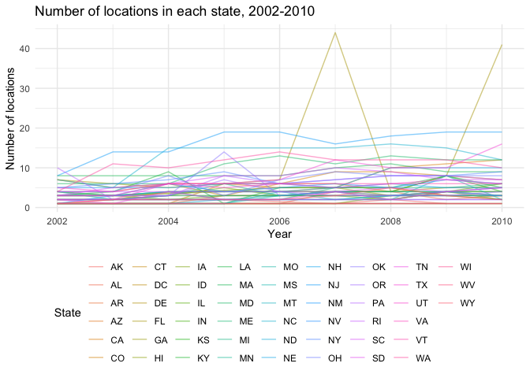

Visualization and EDA
================
Grace Liu
10/11/2018

Problem 1
---------

``` r
brfss_data = brfss_smart2010 %>% 
  janitor::clean_names() %>% 
  filter(topic == "Overall Health")

brfss_data$response = factor(c("Excellent", "Very good", "Good", "Fair", "Poor"))
```

**In 2002, which states were observed at 7 locations? **

``` r
brfss_data %>% 
  group_by(year, locationabbr) %>% 
  filter(year == 2002) %>% 
  summarize(n_locations = n_distinct(locationdesc) == 7) %>% 
  filter(n_locations == TRUE)
```

    ## # A tibble: 3 x 3
    ## # Groups:   year [1]
    ##    year locationabbr n_locations
    ##   <int> <chr>        <lgl>      
    ## 1  2002 CT           TRUE       
    ## 2  2002 FL           TRUE       
    ## 3  2002 NC           TRUE

In 2002, there were 3 states where 7 locations were observed.

**“Spaghetti plot” showing the number of locations in each state from 2002 to 2010**

``` r
brfss_data %>%
  group_by(year, locationabbr) %>%
  count(n_locations = n_distinct(locationdesc)) %>% 
  ggplot(aes(x = year, y = n_locations, color = locationabbr)) + 
    geom_smooth(se = FALSE, alpha = .5) +
    labs(
      title = "Number of locations in each state, 2002-2010",
      x = "Year",
      y = "Number of locations") + 
    theme_minimal()
```

    ## `geom_smooth()` using method = 'loess' and formula 'y ~ x'



The graph above shows the count of locations observed in each (plus DC) for each year between 2002 to 2010.

**Proportion of “Excellent” responses across locations in NY State**

``` r
brfss_data %>%
  group_by(year) %>%
  filter(locationabbr == "NY" & year %in% c(2002, 2006, 2010) & response == "Excellent") %>%
  summarize(mean_excellent = mean(data_value, na.rm = TRUE), 
            sd_excellent = sd(data_value, na.rm = TRUE)) %>% 
  knitr::kable(digits = 2)
```

|  year|  mean\_excellent|  sd\_excellent|
|-----:|----------------:|--------------:|
|  2002|            26.76|           8.48|
|  2006|            15.97|          10.03|
|  2010|            17.30|           8.99|

The mean (standard deviation) of the proportion of “Excellent” responses across locations in NY State was 26.76 (8.48) in 2002, 15.97 (10.03) in 2006, and 17.30 (8.99) in 2010.

**Average proportion in each response category, by response and state**

``` r
brfss_data %>%
  group_by(year, locationabbr, response) %>%
  summarize(mean_response = mean(data_value, na.rm = TRUE)) %>% 
  ggplot(aes(x = year, y = mean_response, color = locationabbr)) + 
    geom_smooth(se = FALSE, alpha = .5) +
    labs(
      title = "Average proportion in each response category",
      x = "Year",
      y = "Average proportion") + 
    theme_minimal() +
    facet_grid(~response)
```

    ## `geom_smooth()` using method = 'loess' and formula 'y ~ x'


The above graph shows, for each response category, the distribution of state-level average proportions over time.
